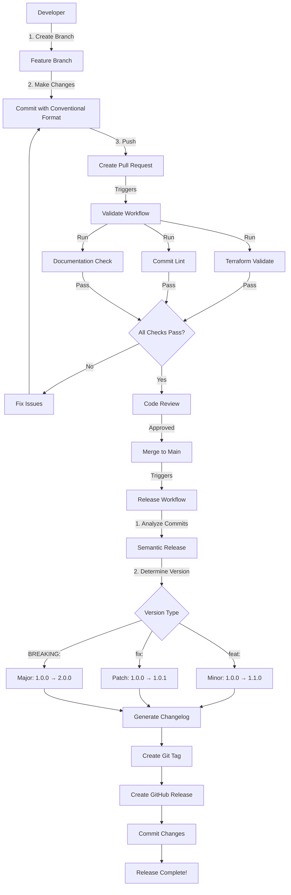
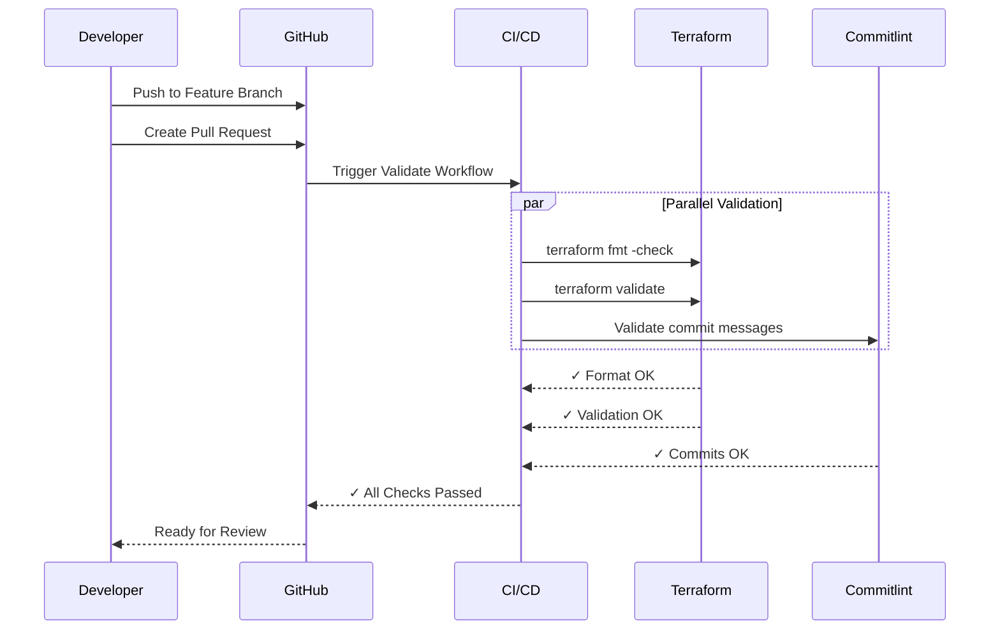
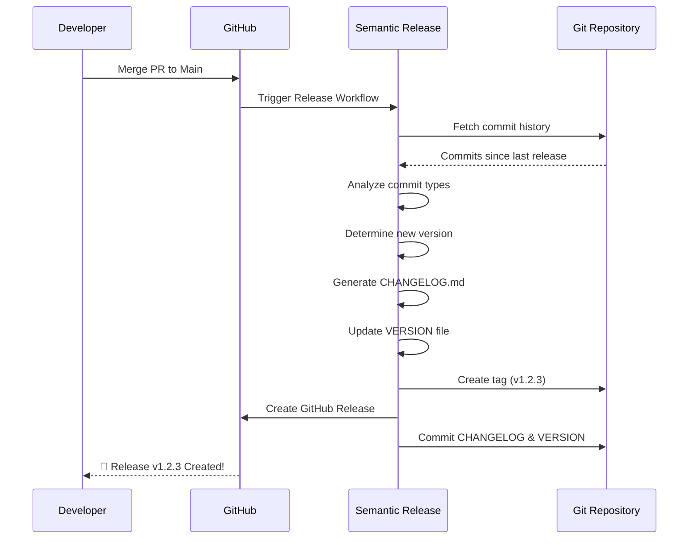
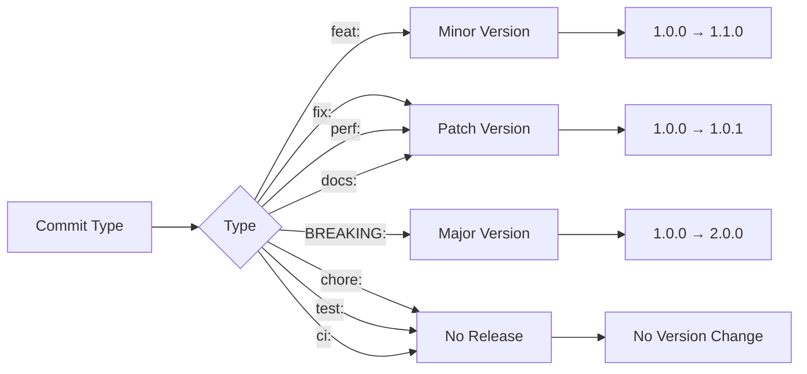
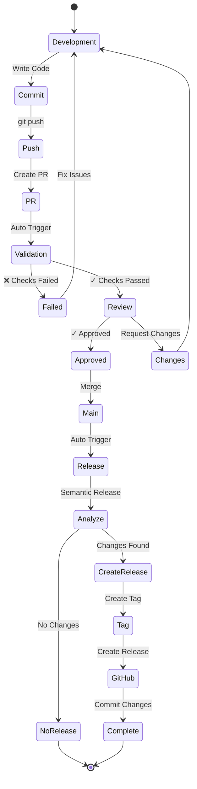

# Workflow Diagram

Visual diagram of CI/CD flow and automated releases.

## Complete Flow

```mermaid
graph TD
    A[Developer] -->|1. Create Branch| B[Feature Branch]
    B -->|2. Make Changes| C[Commit with Conventional Format]
    C -->|3. Push| D[Create Pull Request]
    
    D -->|Triggers| E[Validate Workflow]
    E -->|Run| F[Terraform Validate]
    E -->|Run| G[Commit Lint]
    E -->|Run| H[Documentation Check]
    
    F -->|Pass| I{All Checks Pass?}
    G -->|Pass| I
    H -->|Pass| I
    
    I -->|No| J[Fix Issues]
    J --> C
    
    I -->|Yes| K[Code Review]
    K -->|Approved| L[Merge to Main]
    
    L -->|Triggers| M[Release Workflow]
    M -->|1. Analyze Commits| N[Semantic Release]
    N -->|2. Determine Version| O{Version Type}
    
    O -->|feat:| P[Minor: 1.0.0 → 1.1.0]
    O -->|fix:| Q[Patch: 1.0.0 → 1.0.1]
    O -->|BREAKING:| R[Major: 1.0.0 → 2.0.0]
    
    P --> S[Generate Changelog]
    Q --> S
    R --> S
    
    S --> T[Create Git Tag]
    T --> U[Create GitHub Release]
    U --> V[Commit Changes]
    V --> W[Release Complete!]
```

## Validation Flow (PR)

```mermaid
sequenceDiagram
    participant Dev as Developer
    participant GH as GitHub
    participant CI as CI/CD
    participant TF as Terraform
    participant CL as Commitlint
    
    Dev->>GH: Push to Feature Branch
    Dev->>GH: Create Pull Request
    GH->>CI: Trigger Validate Workflow
    
    par Parallel Validation
        CI->>TF: terraform fmt -check
        CI->>TF: terraform validate
        CI->>CL: Validate commit messages
    end
    
    TF-->>CI: ✓ Format OK
    TF-->>CI: ✓ Validation OK
    CL-->>CI: ✓ Commits OK
    
    CI-->>GH: ✓ All Checks Passed
    GH-->>Dev: Ready for Review
```

## Release Flow (Main)

```mermaid
sequenceDiagram
    participant Dev as Developer
    participant GH as GitHub
    participant SR as Semantic Release
    participant Git as Git Repository
    
    Dev->>GH: Merge PR to Main
    GH->>SR: Trigger Release Workflow
    
    SR->>Git: Fetch commit history
    Git-->>SR: Commits since last release
    
    SR->>SR: Analyze commit types
    SR->>SR: Determine new version
    
    SR->>SR: Generate CHANGELOG.md
    SR->>SR: Update VERSION file
    
    SR->>Git: Create tag (v1.2.3)
    SR->>GH: Create GitHub Release
    SR->>Git: Commit CHANGELOG & VERSION
    
    GH-->>Dev: 🎉 Release v1.2.3 Created!
```

## Commit Types and Impact

```mermaid
graph LR
    A[Commit Type] --> B{Type}
    
    B -->|feat:| C[Minor Version]
    B -->|fix:| D[Patch Version]
    B -->|perf:| D
    B -->|docs:| D
    B -->|BREAKING:| E[Major Version]
    B -->|chore:| F[No Release]
    B -->|test:| F
    B -->|ci:| F
    
    C --> G[1.0.0 → 1.1.0]
    D --> H[1.0.0 → 1.0.1]
    E --> I[1.0.0 → 2.0.0]
    F --> J[No Version Change]
```

## Workflow States

```mermaid
stateDiagram-v2
    [*] --> Development
    Development --> Commit: Write Code
    Commit --> Push: git push
    Push --> PR: Create PR
    
    PR --> Validation: Auto Trigger
    Validation --> Failed: ❌ Checks Failed
    Validation --> Review: ✓ Checks Passed
    
    Failed --> Development: Fix Issues
    
    Review --> Approved: ✓ Approved
    Review --> Changes: Request Changes
    Changes --> Development
    
    Approved --> Main: Merge
    Main --> Release: Auto Trigger
    
    Release --> Analyze: Semantic Release
    Analyze --> NoRelease: No Changes
    Analyze --> CreateRelease: Changes Found
    
    CreateRelease --> Tag: Create Tag
    Tag --> GitHub: Create Release
    GitHub --> Complete: Commit Changes
    
    NoRelease --> [*]
    Complete --> [*]
```
